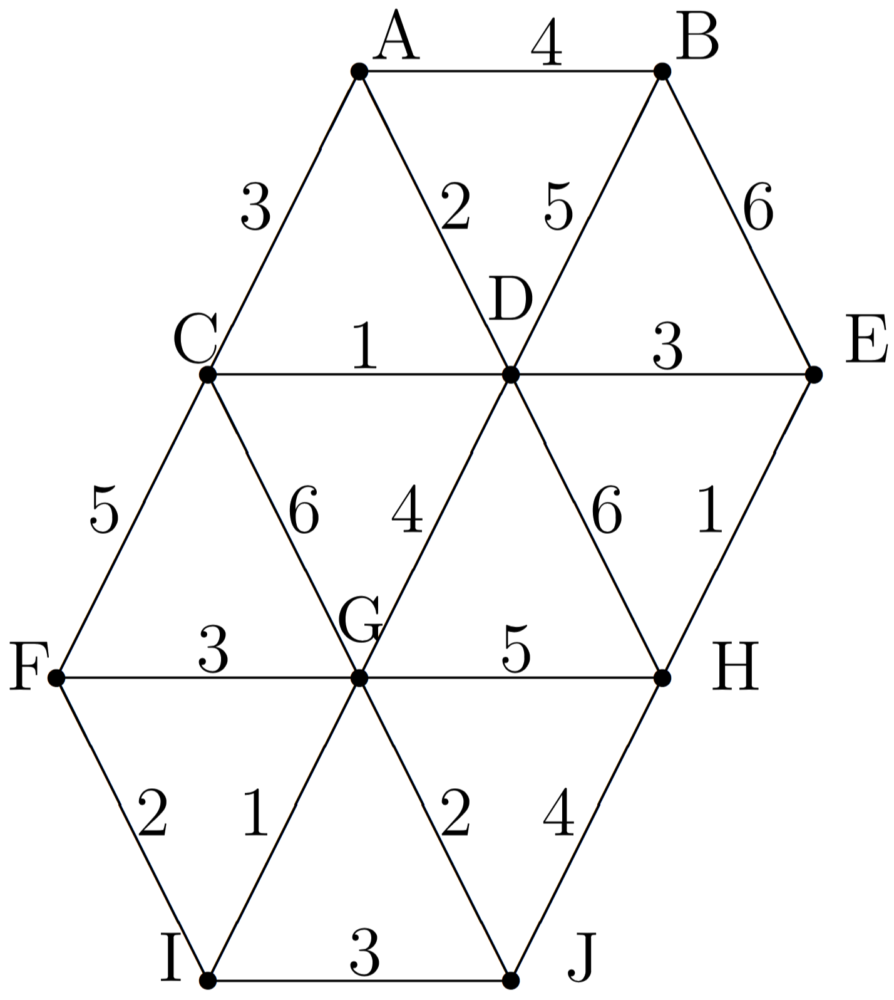
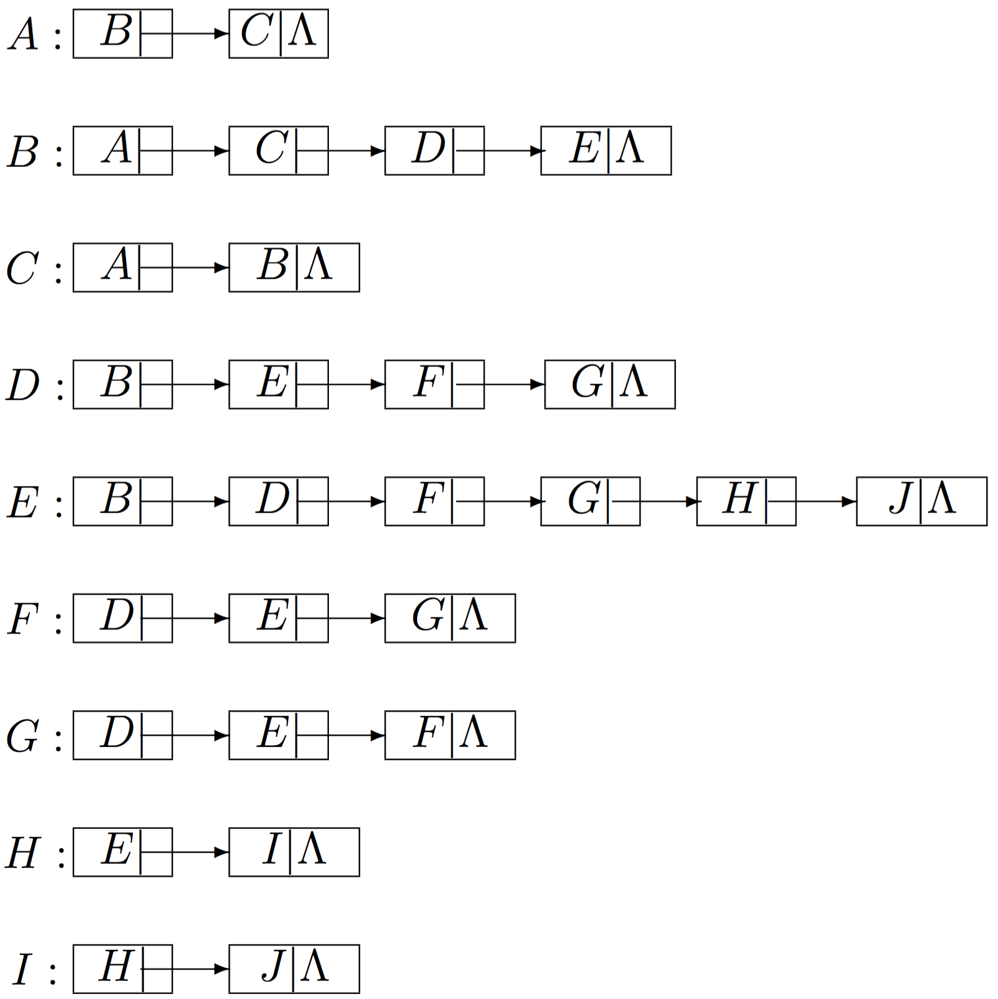

# f16

## 1.
Explain why Depth First Trees have no cross edges, while Breadth First trees have no back edges.

## 2.
Illustrate Horner’s algorithm for evaluating the polynomial
$$
7z^5+4x^4-2z^3+5z^2+3z+2
$$
For full credit, write your answer as a straight-line program.

## 3.
The recursive version of the Fast Fourier Transform is used to evaluate
$$
p(z)=a_{63}z^{63}+a_{62}z^{62}+\cdots+a_1z+a_0
$$
at the 64th roots of unity. Along the way, it must evaluate some cubic polynomials at the 4th roots of unity. List these cubic polynomials

## 4.
We saw in class that the recurrence for the number of additions performed by Strassen’s algorithm is
$$
T(n)=7T\left(\frac{n}{2}\right)+\frac{9}{2}n^2;\:\:\:\:\:\:\:\:T(1)=0,
$$
valid for $$n=2^k$$ for some nonnegative integer $$k$$. Show that there is a constant $$C$$ such that the exact solution for such n is given by $$T(n)=C(n^{\log_2{7}}-n^2)$$, and determine the value of $$C$$. Then find out how large $$n$$ has to be in order for the number of additions performed by Strassen’s to be less than the number performed by the ordinary algorithm. (You’ll probably need at least a calculator to work the last part out. Explain your answer.)

## 5.
Consider the graph $$\mathcal{G}$$ with the following weights:

Use either Prim’s algorithm or Kruskal’s algorithm to determine a minimum spanning tree for $$G$$. Show your work clearly.

## 6.
Assume you have code which implements Dijkstra’s shortest path algorithm for a weighted graph.  Explain how you could modify and/or expand it to implement an algorithm to find the second shortest path from a given vertex $$A$$ to another given vertex $$X$$.

## 7.
Consider the graph, given by adjacency lists, below. ($$\Lambda$$ represents a null pointer)
Find the Depth First Search and Breadth First Search trees for the graph, starting at vertex $$A$$. When Depth First Search is implemented as a stack, what are the contents of the stack just before and after the moment that it could be first determined that the graph is not biconnected.

## 8.
Show the red-black tree that results after each of the letters of $$\text{L}\:\text{U}\:\text{M}\:\text{B}\:\text{E}\:\text{R}\:\text{J}\:\text{A}\:\text{C}\:\text{K}\:\text{I}\:\text{N}\:\text{G}$$ is inserted, in that order, into an initially empty red-black tree. Show the tree that results after each insertion, and make clear any rotations that must be performed.
Indicate a 2-3-4 tree which is equivalent to the final red-black tree.

## 9.
We know that a polynomial of degree at most $$n-1$$ can be evaluated at a single point in $$O(n)$$ time using Horner’s algorithm.  We also saw that such a polynomial may be evaluated at the nth complex roots of unity in $$O(n\:\log{n})$$ time using the Fast Fourier Transform algorithm.  In this problem, we will consider the problem of evaluating a polynomial of degree at most $$n-1$$ at $$n$$ arbitrary values.
We assume that we can use an algorithm called $$\text{REMAINDER}$$, that when passed the polynomials $$a(x)$$ and $$p(x)$$, returns the remainder $$r(x)$$ when $$a(x)$$ is divided by $$p(x)$$. For example, if $$a(x)=3x^3+x^2-3x+1$$ and $$p(x)=x^2+x+2$$, then $$\text{REMAINDER}\left(a(x),\:p(x)\right)$$ returns $$r(x)=-7x+5$$, since
$$
\frac{3x^3+x^2−3x+1}{x^2+x+2}=3x-2+\frac{-7x+5}{x^2+x+2}
$$
or equivalently,
$$
3x^3+x^2-3x+1=(3x−2)(x^2+x+2)+(-7x+5)
$$

**(a)** Given values $$x_1,\:x_2,\:\cdots,\:x_n$$ for evaluation, form polynomials $$P(x)=\prod_{i=1}^{n/2}(x−x_i)$$ and $$P_2(x)\prod_{n/2+1}^{n}(x-x_i)$$. If $$R_2(x)$$ is the polynomial remaider when $$A(x)$$ is divided by $$P_2(x)$$, explain why $$A(x_i)=R_1(x_i)$$ for all $$i\leq\tfrac{n}{2}$$ while $$A(x_i)=R_2(x_i)$$ for all $$i>\tfrac{n}{2}$$.

**(b)** Assuming that $$\text{REMAINDER}$$ can be implemented in $$O(n\log{n})$$ time, for polynomials of degree less than $$n$$, provide a divide-and-conquer algorithm to evaluate $$A(x)$$ at $$x_1,\:x_2,\:\cdots,\:x_n$$ in $$O(n\log^2{n})$$ time.
**NOTE**: You will also need to account for computing the coefficients of $$P_1(x)$$ and $$P_2(x)$$ in your analysis.

**(c)** Suppose you didn’t know how to implement $$\text{REMAINDER}$$ in $$O(n\log{n})$$ time. (It’s not an easy problem.)  How efficient would the implementation have to be in order for your evaluation algorithm to be more efficient than just using Horner’s method in turn on each evaluation?

