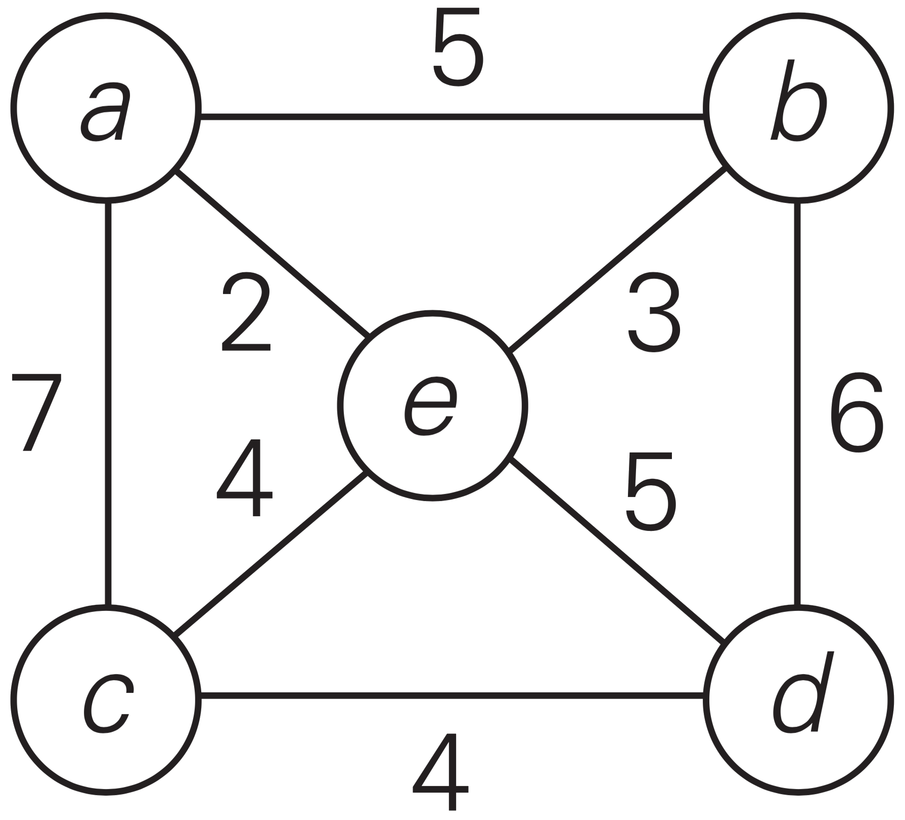
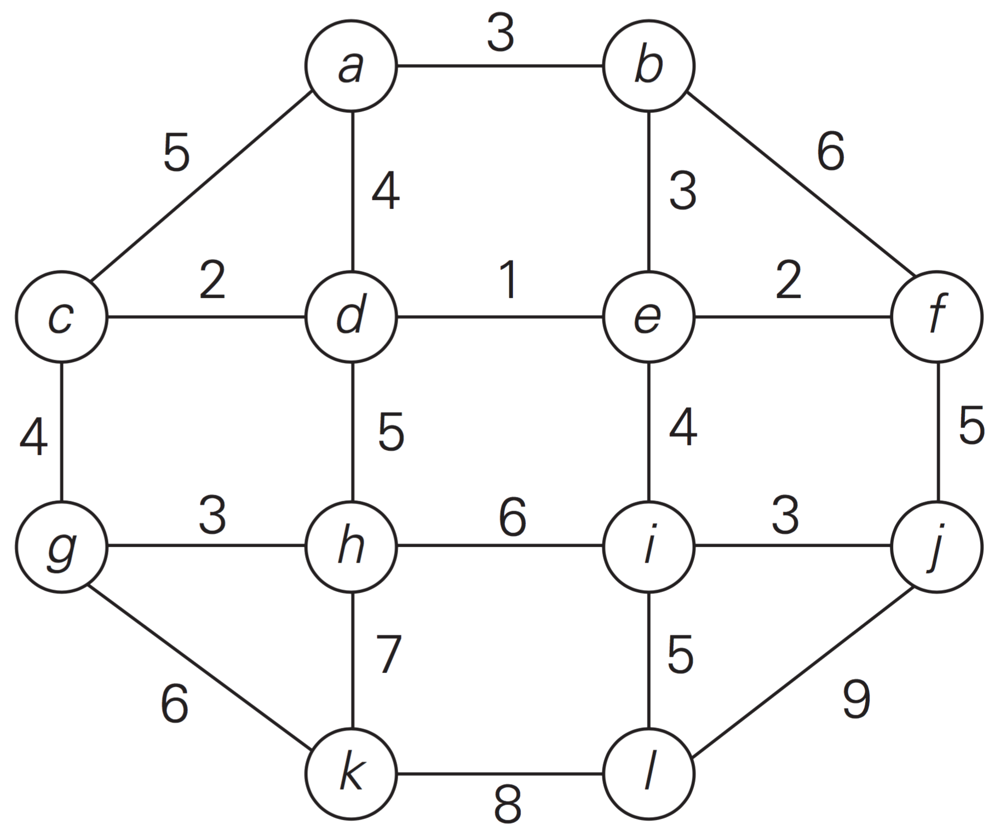
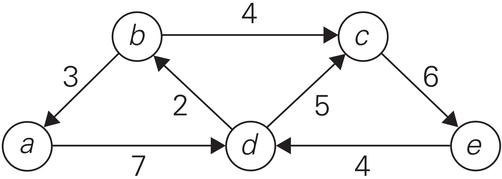
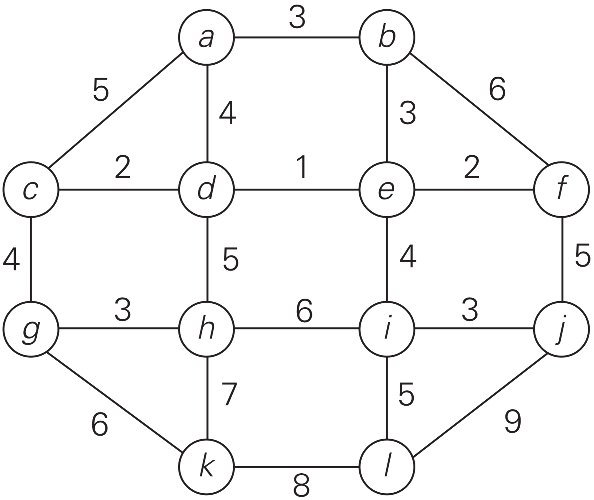

# hw03

## 5.3.2
The following algorithm seeks to compute the number of leaves in a binary tree.

> #### ALGORITHM `LeafCounter`($$T$$)
```
//Computes recursively the number of leaves in a binary tree
//Input: A binary tree, T
//Output: The number of leaves in T
```
> **if** ($$T=\varnothing$$)
>> **return** 0

> **else**
>> **return** `LeafCounter`($$T_\text{left}$$)+`LeafCounter`($$T_\text{right}$$)

Is this algorithm correct? If it is, prove it; if it is not, make an appropriate correction.


## 6.5.4(a)

**(a)** Apply Horner’s rule to evaluate the polynomial
$$
\begin{matrix}
p(x)=3x^4-x^3+2x+5&\text{at }x=-2.
\end{matrix}
$$

**(b)** Use the results of the above application of Horner’s rule to find the quotient and remainder of the division of $$p(x)$$ by $$x+2$$.


## 6.5.10
Is it a good idea to use a general-purpose polynomial-evaluation algorithm such as Horner’s rule to evaluate the polynomial $$p(x)=x^n+x^{n-1}+\cdots+x+1$$?


## 6.5.11
According to the corollary of the Fundamental Theorem of Algebra, every polynomial
$$
p(x)=a_nx^n+a_{n-1}x^{n-1}+\cdots+a_0
$$

can be represented in the form
$$
p(x)=a_n(x-x_1)(x-x_2)\cdots(x-x_n)
$$

where $$x_1,\:x_2,\:\cdots,\:x_n$$ are the roots of the polynomial (generally, complex and not necessarily distinct).  Discuss which of the two representations is more convenient for each of the following operations:

**(a)** polynomial evaluation at a given point

**(b)** addition of two polynomials

**(c)** multiplication of two polynomials


## 9.1.9
**(a)** Apply Prim’s algorithm to the following graph. Include in the priority queue all the vertices not already in the tree.


**(b)** Apply Prim’s algorithm to the following graph. Include in the priority queue only the fringe vertices (the vertices not in the current tree which are adjacent to at least one tree vertex).



## 9.1.10
The notion of a minimum spanning tree is applicable to a connected weighted graph. Do we have to check a graph’s connectivity before applying Prim’s algorithm, or can the algorithm do it by itself?


## 9.1.11
Does Prim’s algorithm always work correctly on graphs with negative edge weights?


## 9.2.1
Apply Kruskal’s algorithm to find a minimum spanning tree of the following graphs.

**(a)**


**(b)**


## 9.2.4
Does Kruskal’s algorithm work correctly on graphs that have negative edge weights?


## 9.3.2
Solve the following instances of the single-source shortest-paths problem with vertex $$a$$ as the source:
**(a)**


**(b)**



## 9.3.3
Give a counterexample that shows that Dijkstra’s algorithm may not work for a weighted connected graph with negative weights.


## 9.3.4
Let $$T$$ be a tree constructed by Dijkstra’s algorithm in the process of solving the single-source shortest-paths problem for a weighted connected graph $$G$$.

**(a)** True or false: $$T$$ is a spanning tree of $$G$$?

**(b)** True or false: $$T$$ is a minimum spanning tree of $$G$$?


## custom.01.
Give the state of the disjoint-sets data structure after the following sequence of operations, starting from singleton sets $$\{a\},\:\{b\},\:\{c\},\:\{d\},\:\{e\},\:\{f\},\:\{g\},\:\{h\},\:\{i\},\:\{j\}$$ Use path compression.  In case of ties, always make the lower-numbered node point to the higher-numbered node.
$$
\begin{matrix}
\text{union}(a,b),&\text{union}(c,d),&\text{union}(e,f),\\
\text{union}(g,h),&\text{union}(i,j),&\text{union}(a,d),\\
\text{union}(f,g),&\text{union}(b,i),&\text{union}(d,e),\\
\text{find}(a).
\end{matrix}
$$

## custom.02.
Show that it is possible to compute the square of a $$2\times2$$ matrix using only $$5$$ multiplications.
